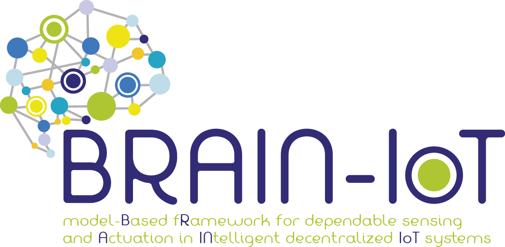

# BrainPEP
[](https://travis-ci.com/eclipse-researchlabs/brain-iot-privacy-control-system-api)
[](https://github.com/psf/black)
[](https://www.python.org/downloads/release)



## Overview
BrainPEP is a back-end that offers RESTful API that follows [OpenAPI Specification](https://swagger.io/specification/).
Its scope is to manage the resources associated to Services and Devices interacting with an Identity and Access Manager i.e. [Keycloak](https://www.keycloak.org/).
For more information 

[](https://ipt-services.polito.it/brainpep/docs)

## Installation

### Prerequisites
1.
   Install [Docker](https://www.docker.com/)

2.
   Install [PostgreSql](https://www.postgresql.org/)
   
clone the repository
````
~$ git clone https://github.com/eclipse-researchlabs/brain-iot-privacy-control-system-api

````

## Configuration


## Benchmarks


## Release Notes
